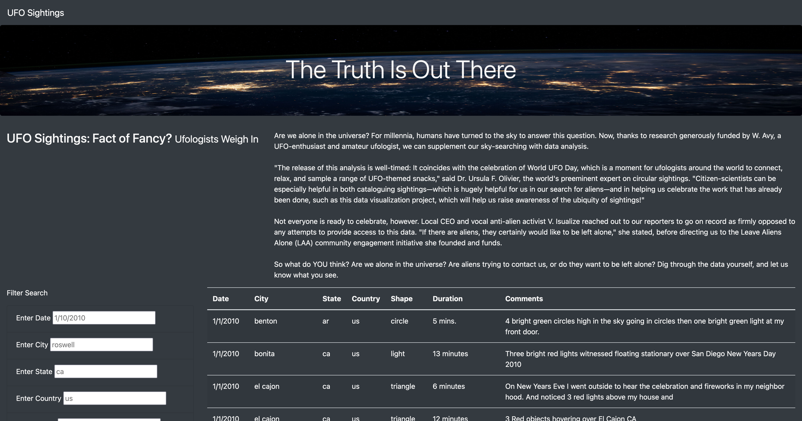
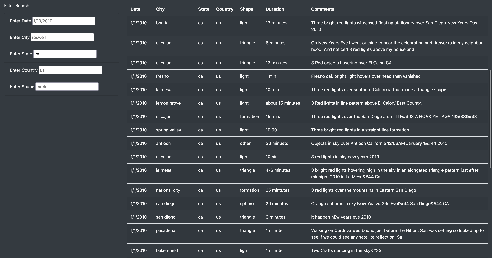
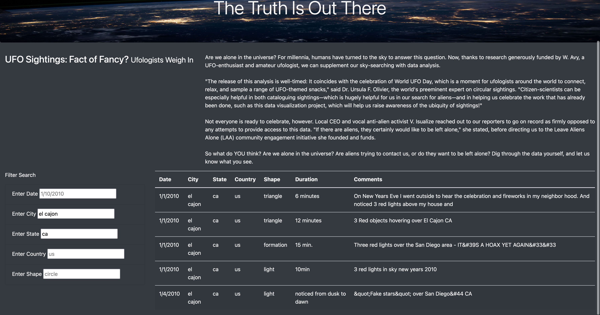
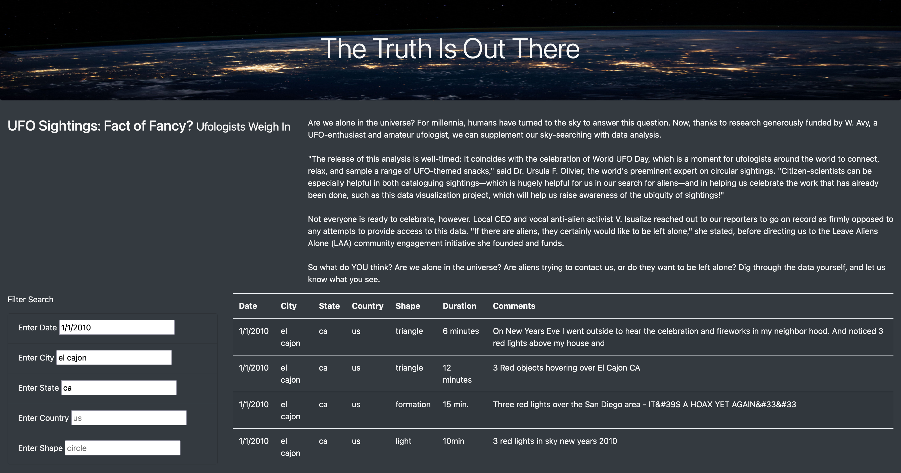
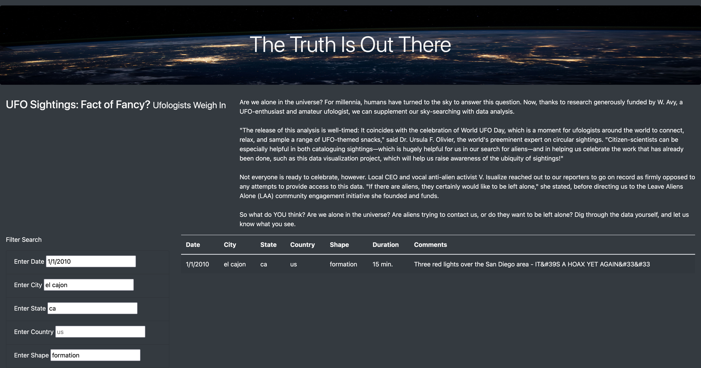

# UFO Filtering with JavaScript

## Overview of Analysis

Dana would like the UFO Finder webpage to have added functionality. She wants the filtering to be more in-depth, filtering for multiple criteria at the same time and have it auto-update rather than clicking a button to update the results. In addition to the date filter, she would like filters for city, state, country, and shape.

## Resources

- Data Source: data.js
- Software: Python 3.7.11, Visual Studio Code 1.67.2

## Results

In order to perform a search, refer to the example below:
- Step 0: To begin, the webpage will look like this by default

- Step 1: Filtering the state category with "ca"

- Step 2: Filtering the city category with "el cajon"

- Step 3: Filtering the date category with "1/1/2010"

- Step 4: Filtering the shape category with "formation"

Provided valid entries are submitted into each filter category, the results will auto-update any time a filter is added or removed.

## Summary

In summary, this webapp works well in applying multiple filters onto the data. One drawback with this webapp is not being able to search for keywords within the comments category. This, along with added functionality of a clear button, to clear all filter critera automatically instead of having to manually delete one by one as well as code added to handle invalid inputs and capitalized letters would benfit this webapp greatly.
